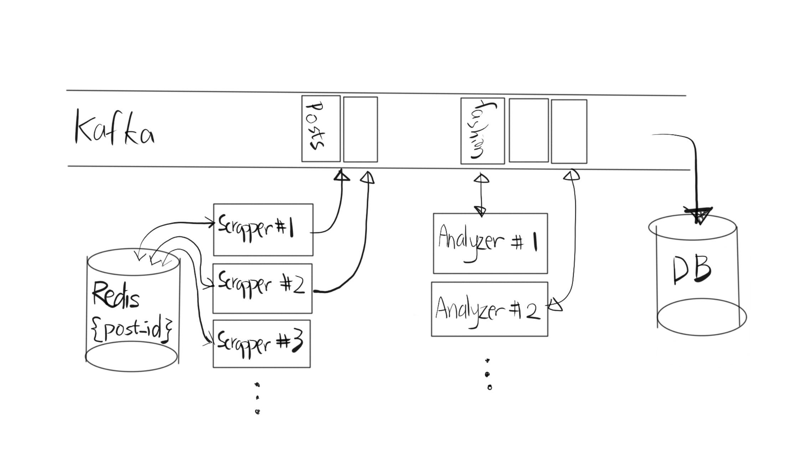

# Running the demo
```
docker-compose up --build --force-recreate --no-deps
```

# Start scrapping posts
Enter the follow in Postman or simply your browser
```
http://localhost:8000/api/scrape/trending?limit=100
```
This will scrape at least 100 posts from Trending. Fashion posts will then be analyzed and logged to the terminal. A list of sample posts can be found in the /sample folder.

# Planned Schema



# Notes

- Currently, the scraper uses Puppeteer to navigate the homepage of TikTok, and monitors network for a content requests and responses. Puppeteer is used because the official API can be expensive (for a take home assignment) and has limitations. The drawback of this approach is its high code of maintenance (API and UI can change frequently, requiring dedicated devs to stay on top of those changes). Additionally, it would be much faster to search for the fashion posts directly instead of looking for the on the trending feed. Given enough time, I would rewrite this with https://github.com/davidteather/TikTok-Api, for ease of maintenance and expanded functionalities. 
- The system uses Kafka as a message queue to connect various services (the scraper, the analyzer, the database, .etc). This allows us to easily scale up data throughput by adding additional scraper/analyzer instances, or by adding more partitions to the Kafka topic. Given additional time, it would be worth looking into deployment via Kubernetes to make dynamic scaling easier. 
- Currently, the analyzer uses 'zero-shot-classification' to label video captions as relevant or not. It would be ideal to analyze comments in addition to captions to compute an aggregated metric for better results. It would also be helpful to setup a database of hashtags relevant to "Fashion" increase accuracy. The hashtag database can be expanded based on newly identified fashion posts.
- Currently, posts / comments / hashtags are not actually written to the database, limiting the system's usefulness. Ideally we should setup a kafka Postgres sink to write filtered data into the db (see init.sql for anticipated schema).
- Currently, scraping is triggered manually through API. Ideally we should setup a cron job to run at various times of the day to scrape the posts. 
- Currently, the scrapped posts are not deduped. Ideally, we can make use of redis to cache post IDs that have been scrapped, and set and expiration of 24 hrs. Before we post messages to Kafka, we check the redis cache for duplicate post IDs. Add the post ID to redis and post message to Kafka broker only if no duplicate is found. 
- The quality of the data can be periodically assessed manually, by taking in a small random sample. We could also use LLMs to sample the data (expensive but ok for a subset of the data).
- Fashion-related accounts has a higher tendency of posting fashion-related content. If the percentage of posts from known* Fashion-related accounts fall below a certain threshold, it might be worth double-checking the data quality - whether posts are labelled accurately, or whether enough posts are scrapped daily. 
- To analyze a fashion post's relevance, we could incoporate metrics such as like count, share count, percentage of positive comments (with ML labelling). 
- Currently, there is no real logging setup. Logging is critical when it comes to debugging problems with the system and alerting the team of breaking changes (TikTok blacklists IP, UI changes, .etc). Mezmo, Sentry are some of the options available. 


